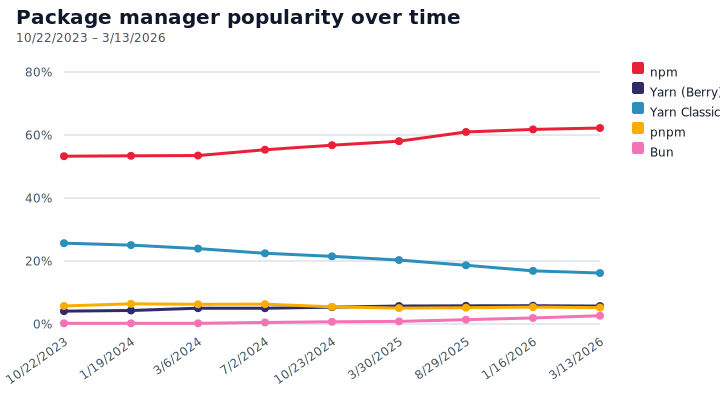
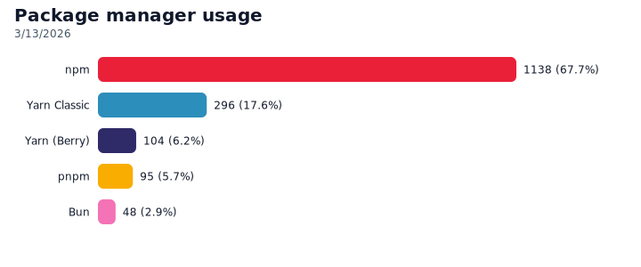
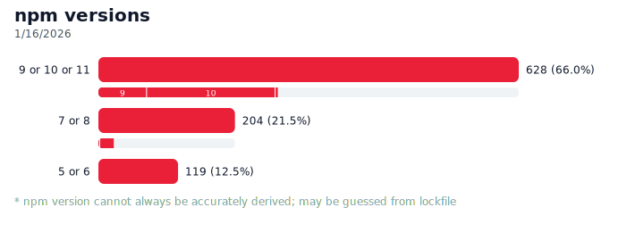
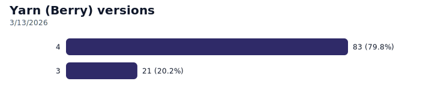
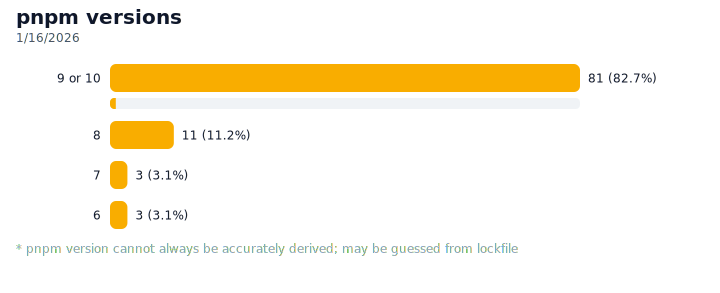

# package-manager-stats

Script to get stats about package managers used in most popular projects on GitHub.

## Prerequisites

- [Node.js](https://nodejs.org) 22.6 or later with [Corepack](https://nodejs.org/api/corepack.html) enabled

## Usage

Add `.env` file with GitHub token:

```sh
GITHUB_TOKEN=…
```

Install:

```sh
yarn
```

Run:

```sh
yarn start
```

Optionally, you can run script in debug mode to see more logs. Bear in mind that it will take much more time to run.

```sh
DEBUG=true yarn start
```

### Generating charts

Create fresh SVGs from the saved results:

```sh
yarn charts
```

Outputs land in [charts](charts) directory. Version charts are produced only when a package manager has more than one major version.

## Charts

<picture>
	<source media="(prefers-color-scheme: dark)" srcset="./charts/package-manager-trend-dark.svg" />
	
</picture>

<picture>
	<source media="(prefers-color-scheme: dark)" srcset="./charts/package-manager-stats-dark.svg" />
	
</picture>

<picture>
	<source media="(prefers-color-scheme: dark)" srcset="./charts/package-manager-version-stats-npm-dark.svg" />
	
</picture>

<picture>
	<source media="(prefers-color-scheme: dark)" srcset="./charts/package-manager-version-stats-yarn_modern-dark.svg" />
	
</picture>

<picture>
	<source media="(prefers-color-scheme: dark)" srcset="./charts/package-manager-version-stats-pnpm-dark.svg" />
	
</picture>
