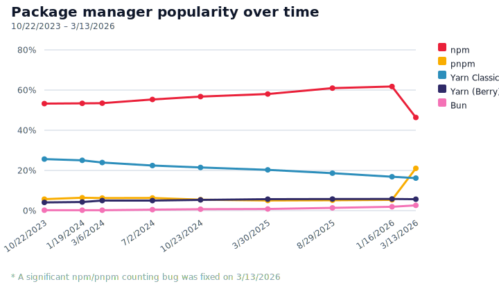
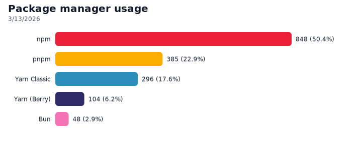
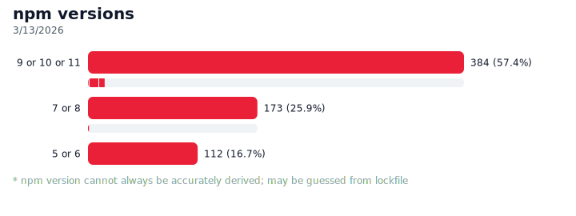
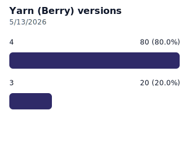
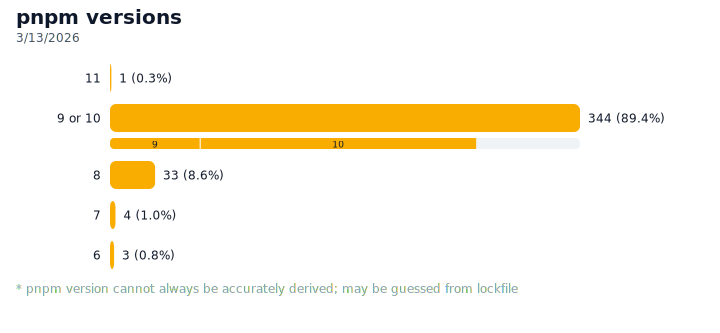
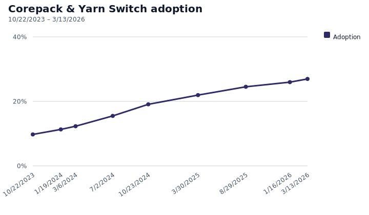

# package-manager-stats

Script to get stats about package managers used in most popular projects on GitHub.

## Prerequisites

- [Node.js](https://nodejs.org) 22.18 or later with [Corepack](https://nodejs.org/api/corepack.html) enabled

## Usage

Add `.env` file with GitHub token:

```sh
GITHUB_TOKEN=…
```

Install:

```sh
yarn
```

Run:

```sh
yarn start
```

Optionally, you can run script in debug mode to see more logs. Bear in mind that it will take much more time to run.

```sh
DEBUG=true yarn start
```

### Generating charts

Create fresh SVGs from the saved results:

```sh
yarn charts
```

Outputs land in [charts](charts) directory. Version charts are produced only when a package manager has more than one major version.

## Charts

<picture>
	<source media="(prefers-color-scheme: dark)" srcset="./charts/package-manager-trend-dark.svg" />
	
</picture>

<picture>
	<source media="(prefers-color-scheme: dark)" srcset="./charts/package-manager-stats-dark.svg" />
	
</picture>

<picture>
	<source media="(prefers-color-scheme: dark)" srcset="./charts/package-manager-version-stats-npm-dark.svg" />
	
</picture>

<picture>
	<source media="(prefers-color-scheme: dark)" srcset="./charts/package-manager-version-stats-yarn_modern-dark.svg" />
	
</picture>

<picture>
	<source media="(prefers-color-scheme: dark)" srcset="./charts/package-manager-version-stats-pnpm-dark.svg" />
	
</picture>

<picture>
	<source media="(prefers-color-scheme: dark)" srcset="./charts/corepack-adoption-trend-dark.svg" />
	
</picture>

### Methodology

The dataset comes from GitHub repository search results for JavaScript and TypeScript projects, fetched separately, sorted by stars, and limited to up to 1000 results per language. That makes the charts a snapshot of the most-starred repositories matching the query.

Calculation is simple: for each repo, the script prefers the `packageManager` field in `package.json`, then falls back to lockfile-based signals. Version charts use the best available version signal, sometimes only inferring a major version from lockfile format.

Other methodologies are possible. If you inspect the source, you will find alternative selection rules you can try yourself.
